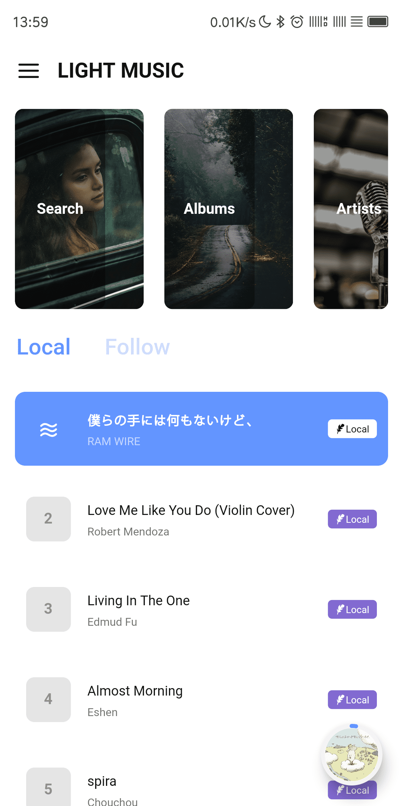
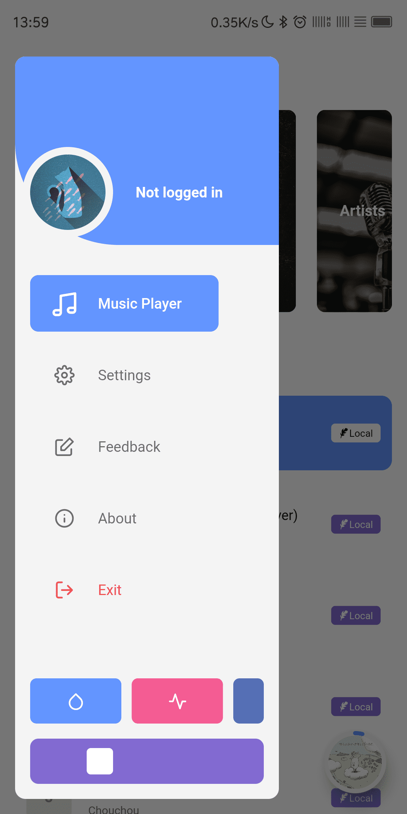
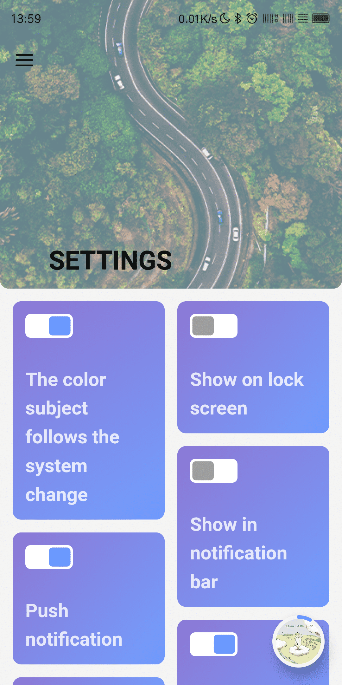
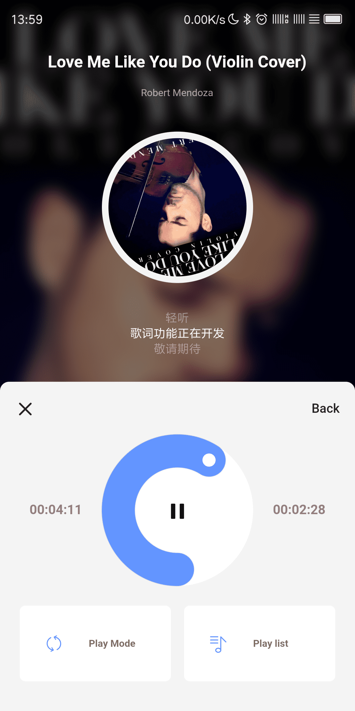
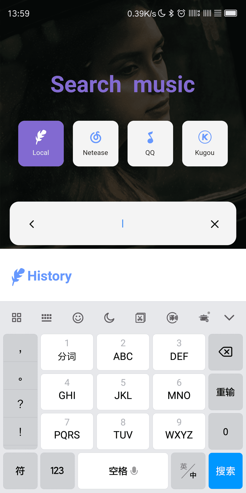
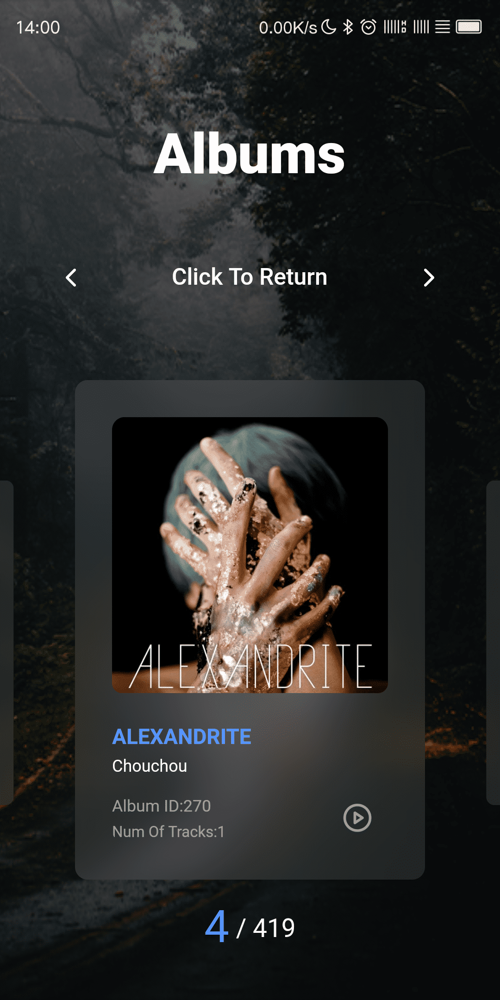

# light_music

Part of the music player detached from Light player.

>由于时间原因，抽离音频播放模块单独开发  
>时间主要花在了UI设计，动画与交互设计与性能优化等方面  
>目前仅支持Android

Demo：[下载 APK-Demo](preview/light_music.apk)

>TIPS:

* 悬浮按钮可长按拖动
* 悬浮按钮支持手势: 左滑上一曲，右滑下一曲，上滑打开播放界面，双击展开侧边栏

>NEXT:

* 添加首次运行的使用帮助
* 完成本地存储
* 优化音乐扫描速度

图片预览 | - | - |
-|-|-
||
||

插件 | 作用 |
-----|-----
flutter_bloc|状态管理
shared_preferences|本地存储 (暂未使用)
permission_handler|权限请求
dio|网络请求
dio_flutter_transformer|网络请求辅助
path_provider|路径
flutter_screenutil|屏幕元素大小适配
flutter_easyrefresh|下拉刷新
cached_network_image|加载网络图片
flutter_swiper|Swiper
photo_view|图片查看 (暂未使用)
flutter_icons|第三方图标集
extended_nested_scroll_view|解决NestedScrollView嵌套头部折叠问题 与tabbarview列表同步问题
badges|角标 (暂未使用)
percent_indicator|环形进度条
sleek_circular_slider|环形可拖动进度条
flutter_xlider|直线可拖动进度条
audioplayers|音乐播放器
audio_service|后台播放 (暂未使用)
flutter_audio_query|获取本地音乐信息。目前仅支持Android
flushbar|消息弹窗
sqflite|本地数据库 (暂未使用)
flutter_staggered_grid_view|瀑布流
